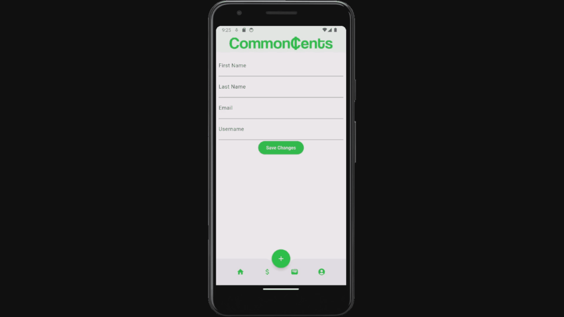

# Minimum Viable Product (MVP)

**e: evaluation**

**d: design**

**r: requirements**

1.0.r The app shall allow users to track their monthly income and expenses through user input.

  - 1.0.d.1: The app shall contain a Budget page with the following UI elements:
    - A box displaying the title and amount for each income/expsense
    - Each box shall be color coded green for income and red for expense

  - 1.0.d.2: The app shall contain a Home page with the following UI elements:
    - A "Welcome Back, <First Name>" text box
    - An "Income" overview displaying the total income for the month
    - An "Expenses" overview displaying the total expenses for the month
    - A "Net Income" overview displaying the total income - total expenses

  - 1.0.e: This requirement will be evaluated by conducting user testing to ensure that users can successfully input and track their monthly income and expenses.

1.1.r The app shall allow users to log in with a username and password pair.

  - 1.1.d The app shall contain a Login page with the following UI elements:
    - "Username" text field
    - "Password" text field
    - "Login" button
    - "Create Account" button

  - 1.1.e: This requirement will be evaluated by user testing on the home page where it asks for login information.

1.2.r The app shall salt and hash user passwords to ensure security.

  - 1.2.d The app shall use a 256-bit salt and the SHA-256 hashing algorithm.

  - 1.2.e This requirement will be evaluated by analyzing the "salt" and "password" fields of the account tuples stored in the database.

1.3.r The app shall allow users to create accounts with their first name, last name, username, email, and password.

  - 1.3.d The app shall contain a Create Account page with the following UI elements:
    - "First Name" text field
    - "Last Name" text field
    - "Email" text field
    - "Username" text field
    - "Password" text field
    - "Confirm Password" text field
    - "Create Account" button

  - 1.3.e This requirement will be evaluated by checking that a tuple is created for each user upon submission through the app.

1.4.r The app shall allow users to edit the first name, last name, username, and email of their account.

  - 1.4.r This requirement will be evaluated by checking that the edited fields trigger a change in the user tuple in the database upon submission through the app.

2.0.r The app shall store and retrieve and display income and expense data for multiple users.

  - 2.0.d The app shall contain an Account page with the following elements:
    - "First Name" text field
    - "Last Name" text field
    - "Email" text field
    - "Username" text field
    - "Save Changes" button

  - 2.0.e This requirement will be evaluated by inputting income and expense data on multiple user accounts and ensuring that users can only view and submit records to their account.

3.0.r  The app shall allow users to plan large purchases by calculating monthly savings based on the total price and desired goal date.

  - 3.0.d: The app shall contain a Goals page with the following elements:
    - "Goal Amount" number field
    - "Goal date" date field
    - "Goal monthly" number field (appears based on "Switch to monthly goal")
    - "Switch to monthly goal" button

  - 3.0.e: This requirement will be evaluated by ensuring that any goal created by the user displays a correct recommended monthly payment.

4.0.r The app shall be supported on iOS devices.

  - 4.0.e: This requirement will be evaluated by testing on at least one iOS device.

4.1.r The app shall be supported on Android devices.

  - 4.0.e: This requirement will be evaluated by testing on at least one Android device.

