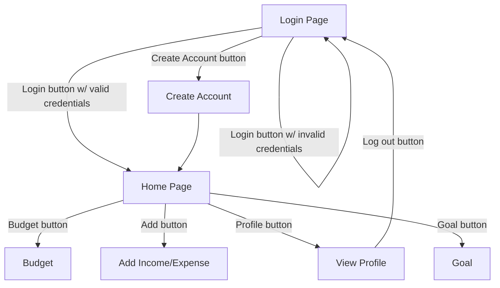

# Design Specifications

## INTRODUCTION

This software design document describes the architecture and system design of CommonCents - a mobile budgeting app to help users manage their finances.

## SYSTEM OVERVIEW

Give a general description of the functionality, context and design of your project. Provide any background information if necessary.

### REQUIREMENTS

| Req No. | Requirement                                                                                                                     |
| ------: | ------------------------------------------------------------------------------------------------------------------------------- |
| 1.0     | The app shall allow users to track their monthly expenses through user input.                                                   |
| 2.0     | The app shall allow users to log in with a username and password pair.                                                          |
| 2.1     | The app shall store and retrieve historical expense data for multiple users.                                                    |
| 3.0     | The app shall allow users to plan large purchases by calculating monthly savings based on the total price and desired goal date.    |
| 3.1     | The app shall allow users to plan large purchases by calculating a goal date based on total price and desired monthly savings.  |
| 4.0     | The app shall be supported on iOS devices.                                                                                      |
| 4.1     | The app shall be supported on Android devices.                                                                                  |

## SYSTEM ARCHITECTURE

### Login Page

The Login Page is the first page displayed to the user upon opening the app. It allows users to either enter their login credentials or create an account.

### Home Page
The Home Page is the page the user sees upon logging in. It allows users to see their summaries and navigate to the other pages.

### Income/Expense Page
### Budget Page
### Goals Page
### Account Page

The account page displays the user's first name, last name, username, and email. From this page, users can choose to change these fields or log out.

## DATA DESIGN

### Data Description
Explain how the information domain of your system is transformed into data structures. Describe how the major data or system entities are stored, processed, and organized. List any databases or data storage items.

## INTERFACE DESIGN

### Login Page

- "Username" text field
- "Password" text field
- "Login" button
- "Create Account" button

### Create Account Page

- "First Name" text field
- "Last Name" text field
- "Email" text field
- "Username" text field
- "Password" text field
- "Confirm Password" text field
- "Create Account" button

### Home Page
- "Home Icon" button
- "Goal Icon" button
- "Metrics Icon" button ( includes Income and expense)
- "Login Icon" button
- "Add Icon" button
- "Budget Icon" button
- "Goal summary" text output based on the "Goal Page" data.
- "Income/expense summary" text output based on the "Metrics Page" data.
- "Budget Summary" text output based on the "Budget Page" data.
  
### Income/Expense Page
### Budget Page
- "Budget" Icon
- "Budget Indicator" Icon
- "Mothly Statement" button
- "Yearly Statement" button
- Monthly Statement button opens up to the expense page on that month
- Yearly Statement button opens up to the expense page on that year
### Goals Page
- "Goal Amount" number field
- "Goal date" date field
- "Goal monthly" number field (appears based on "Switch to monthly goal")
- "Switch to monthly goal" button
### Account Page

The account page displays the user's first name, last name, username, and email. From this page, users can choose to change these fields or log out.
