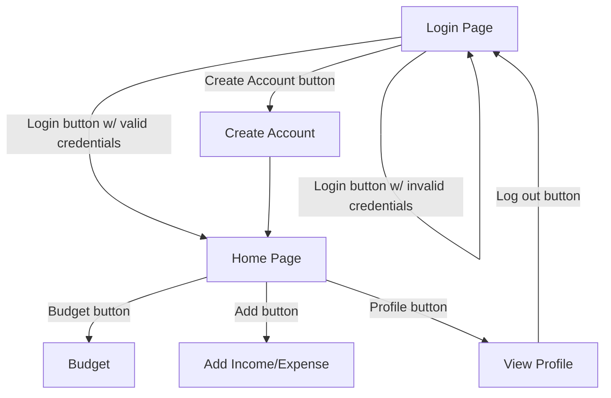

# Design Specifications

```mermaid
flowchart TD;
    A[Login Page] --"Create Account" button --> B[Create Account]
    A -- "Login" button w/ valid credentials --> C[Home Page]
    A -- "Login" button w/ invalid credentials --> A
    B --> C
    C -- "Budget" button --> D[Budget]
    C -- "Add" button --> E[Add Income/Expense]
    C -- "Profile" button --> F[View Profile]
    F -- "Log out" button --> A
```
