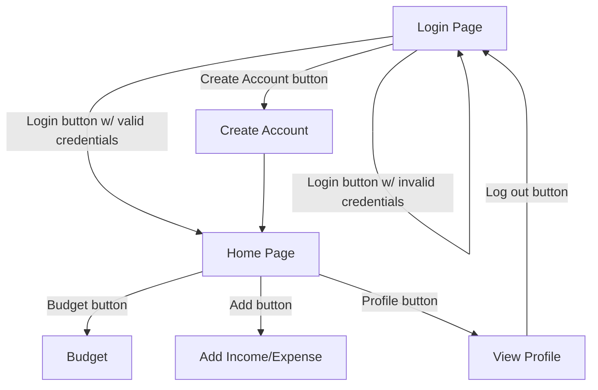

# Design Specifications

## Requirements

| Req No. | Requirement                                                                                                                     | Evaluation Method |
| ------: | ------------------------------------------------------------------------------------------------------------------------------- | ----------------- |
| 1.0     | The app shall allow users to track their monthly expenses through user input.                                                   | Software verified |
| 2.0     | The app shall allow users to log in with a username and password pair.                                                          | Software verified |
| 2.1     | The app shall store and retrieve historical expense data for multiple users.                                                    | Software verified |
| 3.0     | The app shall allow users to plan large purchases by calculating monthly savings based on total price and desired goal date.    | Software verified |
| 3.1     | The app shall allow users to plan large purchases by calculating a goal date based on total price and desired monthly savings.  | Software verified |
| 4.0     | The app shall be supported on iOS devices.                                                                                      | Software verified |
| 4.1     | The app shall be supported on Android devices.                                                                                  | Software verified |

## Design

| Des. No | Design                                                                                                                                                        |
| ------: | ------------------------------------------------------------------------------------------------------------------------------------------------------------- |
| 1.0     | The app shall contain a "Budget" page that outlines the user's income and expenses.                                                                           |
| 1.1     | The app shall contain an "Add Income/Expense" form with a "Label" text field, an income/expense selection, an "Amount" text field, and an "Add" button.       |
| 1.2     | The app shall add the labelled income or expense to the database once the "Add" button is pressed.                                                            |
| 2.0     | The app shall display a "Log In" form containing "Username" and "Password" text fields and a "Log In" button.                                                 |
| 2.1     | When the "Log In" button is pressed, the app shall verify the user credentials and pull their income/expense data from the database.                          |
| 3.0     | The app shall contain a "Goals" page that outlines user spending goals.                                                                                       |
| 3.1     | The app shall contain an "Add Goal" page with "Label," "Amount," and "Goal Date" text fields and an "Add Goal" button.                                        | 
| 3.2     | When the "Add Goal" button is pressed, the input field data shall be submitted to the database and displayed on the "Goals" page.                             |